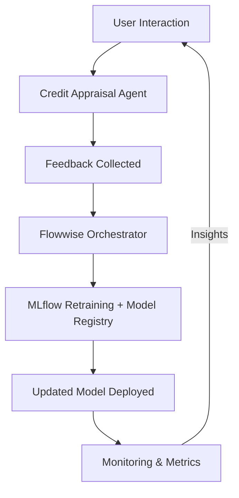

# 💳 Credit Appraisal Agent — AI That Learns from the Real World

> ⚡ *Open Source • Privacy-First • Self-Improving • Production-Ready*

---

## 🌍 Overview

The **Credit Appraisal Agent** is an open-source, explainable AI system that automates credit risk evaluation.
It analyzes income, collateral, and debt information to produce **transparent, bias-free, and legally compliant** lending decisions — instantly.

This Proof-of-Concept (PoC) is part of a broader **AI Agent Library** initiative: a collection of modular, self-improving agents designed to learn continuously from real users for real-world applications.

---

## 🧩 Current PoC Architecture

### 🧱 Components and Tools (Today)

| Layer                   | Purpose                                                      | Tools / Frameworks                   |
| ----------------------- | ------------------------------------------------------------ | ------------------------------------ |
| **Frontend**            | Web interface for uploading data and viewing results         | Streamlit                            |
| **API Layer**           | REST endpoints for model inference, feedback, and retraining | FastAPI                              |
| **Model**               | Logistic Regression / Random Forest                          | scikit-learn + joblib                |
| **Feature Engineering** | DTI, LTV, CCR, ITI, affordability ratios                     | Pandas + NumPy                       |
| **Retraining Loop**     | Human review → feedback CSV → automatic retrain              | FastAPI `/v1/training/train`         |
| **Storage**             | Local JSON and joblib model registry                         | File system                          |
| **Visualization**       | Approval rates, collateral mix, reasons for denial           | Streamlit + Plotly                   |
| **Deployment (PoC)**    | Local or Docker-based single node                            | Linux + Python venv / Docker Compose |

### 🔁 Data Flow (PoC)

```
User Uploads Dataset
   ↓
FastAPI processes and appraises via model
   ↓
Dashboard displays explainable results
   ↓
Human feedback exported to CSV
   ↓
Retraining improves next model version
```

---

## 🚀 From PoC to Production — Scaling Vision

Transitioning from a single proof-of-concept into a **production-grade, multi-agent AI platform** capable of integrating structured data, documents, and real-time feedback.

### ⚙️ Scalable Production Architecture

| Layer                | Tool / Platform                       | Description                                          |
| -------------------- | ------------------------------------- | ---------------------------------------------------- |
| **Frontend**         | Streamlit / React                     | Secure web portal for credit officers                |
| **API Gateway**      | FastAPI + Nginx + Gunicorn            | Load-balanced REST API                               |
| **Orchestration**    | Flowwise / Dataiku / Kubeflow         | Multi-agent workflows and model retraining pipelines |
| **AI Engine**        | scikit-learn + Hugging Face + OpenLLM | Mix of classical ML and transformer-based reasoning  |
| **Data Management**  | PostgreSQL + MinIO / Ceph / S3        | Structured + unstructured data storage               |
| **Model Registry**   | MLflow + Helm + ArgoCD (GitOps)       | Versioning, promotion, and rollback                  |
| **Monitoring**       | Prometheus + Grafana + Loki           | Telemetry and model drift analytics                  |
| **Security**         | Vault + OAuth2                        | Encryption, identity, and audit control              |
| **Compute Platform** | Kubernetes / OpenStack / GPU Cloud    | Hybrid deployment across any environment             |

---

## 🤝 Future Integrations

### 🧠 Hugging Face & OpenLLM

Integrate transformer models to interpret unstructured documents (bank statements, payslips) for deeper scoring accuracy.

### 📊 Dataiku & Flowwise

Visual orchestration for automated retraining and multi-model decision pipelines (credit + fraud + risk).

### 📚 Open Datasets

Incorporate **UCI**, **Kaggle**, and **World Bank** datasets blended with anonymized local data to train models responsibly.

### 🌐 Multi-Cloud, Multi-Region

Deploy seamlessly across **Kubernetes**, **OpenStack**, or **GPU-for-Rent** sandboxes while respecting data-sovereignty laws.

---

## 🧬 The AI Agent Library Vision — Self-Improving by Design

The **Credit Appraisal Agent** is one node in a larger ecosystem of **AI micro-agents** (Credit, Fraud, KYC, AML, Real-Estate, Education, etc.).
Each agent continuously learns from real user feedback and retrains autonomously — forming a living, evolving **AI Factory** for practical business AI.

> 💡 *Each decision and user correction becomes a new training signal — a feedback loop that keeps improving the system organically.*

### 🧩 Agent Evolution Workflow



---

## 🌍 Compliance and Data Sovereignty

✅ 100 % compliant with **GDPR**, **Vietnam Data Law 2025**, and other global privacy regulations.
🔒 Trains only on **synthetic or anonymized data**, ensuring full legality on cross-border GPU infrastructure.
⚙️ Designed for **data localization**: only model weights, never personal data, are transmitted externally.

---

## 🧱 Deployment Flexibility

```bash
# Example: Deploy via Helm + Kustomize
helm upgrade --install credit-appraisal ./deployment \
  -f deployment/values.yaml -n credit-ai --create-namespace
```

Accessible via:

```
https://credit-appraisal.local
```

---

## 🚀 Summary — Why It Matters

| Value                        | Description                            |
| ---------------------------- | -------------------------------------- |
| 🕒 Faster Lending Decisions  | From days to seconds                   |
| 🧠 Transparent & Explainable | Each result includes reason codes      |
| 🔐 Private & Compliant       | Works under any jurisdiction           |
| ☁️ Cloud-Agnostic            | Runs on any cloud or local environment |
| 🔁 Continuously Learning     | Improves with real user feedback       |

---

> 🧠 *“From sandbox to self-learning , self improving Agent models factory, to production — AI that learns from the people it serves.”*

## 🧰 Global AI Sandbox Integration

The credit appraisal agent now ships with tooling to participate in the global
[AI-AIGENTbythePeoplesANDBOX](https://github.com/Sherlock2019/AI-AIGENTbythePeoplesANDBOX.git)
infrastructure where **each agent lives in its own repository**.

1. **Bootstrap the multi-repo workspace**
   ```bash
   chmod +x scripts/init_multi_repo.sh
   ./scripts/init_multi_repo.sh --workspace ~/rackspace-aisandbox \
       --hub-ref main --credit-ref main --asset-ref main
   ```
   The script clones the official
   [`AI-AIGENTbythePeoplesANDBOX`](https://github.com/Sherlock2019/AI-AIGENTbythePeoplesANDBOX.git)
   repository, adds the credit and asset appraisal services as git submodules,
   and (optionally) seeds FastAPI boilerplate when the orchestrator repo is
   empty. Use `--skip-seed` if the hub already contains its own implementation,
   or run `./scripts/init_multi_repo.sh --help` for additional options (e.g.
   pinning specific branches).

2. **Configure agent discovery**
   - Copy `infra/agent_registry.example.yaml` to `infra/agent_registry.yaml`.
   - Update the URLs to match where each agent is running (local ports, Docker
     containers, or remote servers).

3. **Launch the stack**
   - Start each agent (credit, asset, etc.).
   - Run the hub FastAPI app inside the orchestrator repo: `uvicorn
     services.api.main:app --port 8090`.
   - Invoke the hub endpoint: `curl -X POST
     http://localhost:8090/run/credit_appraisal -d '{"text": "sample"}'`.

See `docs/multi_repo_sandbox.md` for a deeper walkthrough that covers the
repository layout, CI/CD considerations, and ideas for extending the shared
agent ecosystem.

---
